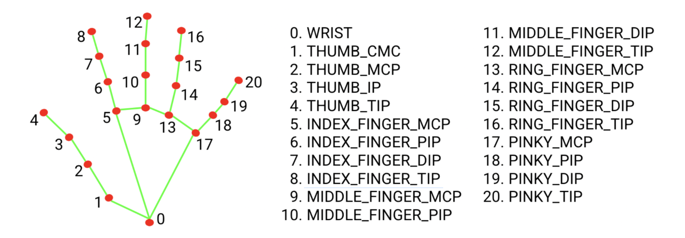

# Funning project

`02/04/2025, 16:38`

For this project, I'd like to use mediapipe to add special effects to a video in real time and as an input.

A fun project that I'll post on LinkedIn.

`20/04/2025, 19:29`

I completed the project today, starting at 4 pm and finishing at 7 pm. The exciting part here was creating the dynamic calligraphy, which was completely new to me, but after some thought, I just had to display each directly on the drawing area frame by frame.

It's also important to know this drawing, which represents how Mediapipe does handmarking.

I'll let you watch the demo. [link](final.mp4)

<video width="640" height="360" controls>
  <source src="final.mp4" type="video/mp4">
  Your browser does not support the video tag.
</video>